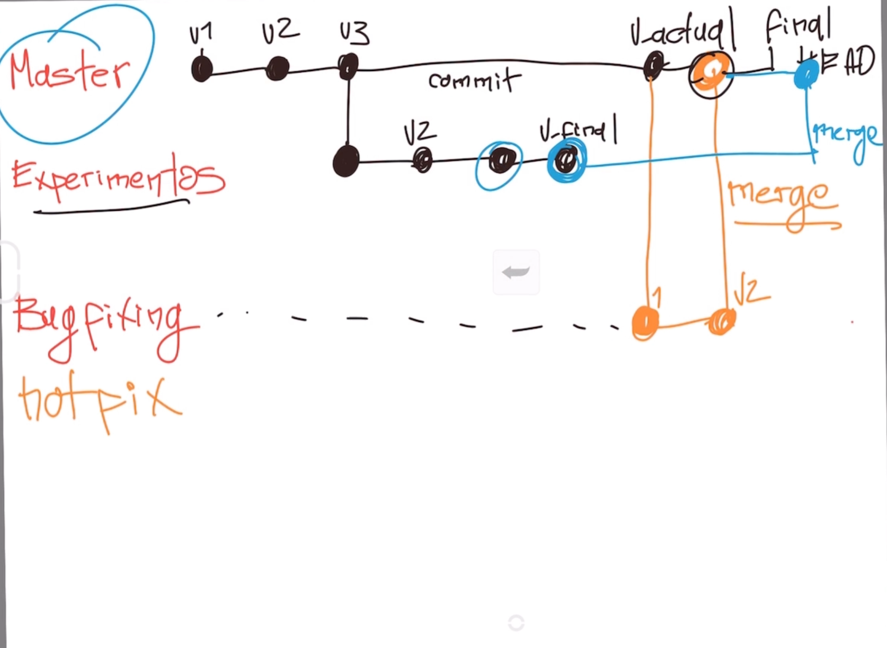

### Profesor: John Freddy Vega

## Clase 2 - ¿Por qué usar un sistema de control de versiones como Git?

[Url](https://platzi.com/clases/1557-git-github/19934-por-que-usar-un-sistema-de-control-de-versiones--4/)

Un sistema de control de versiones como Git nos ayuda a guardar el historial de cambios y crecimiento de los archivos de nuestro proyecto.

En realidad, los cambios y diferencias entre las versiones de nuestros proyecto pueden tener similitudes, algunas veces los cambios pueden ser solo una palabra o una parte específica de un archivo específico. 

Git está optimizado para guardar todos estos cambios de forma atómica e incremental, o sea, aplicando cambios sobre los últimos cambios, estos sobre los cambios anteriores y así hasta el inicio de nuestro proyecto.

- El comando para iniciar nuestro repositorio, o sea, indicarle a Git que queremos usar su sistema de control de versiones en nuestro proyecto, es `git init`.
- El comando para que nuestro repositorio sepa de la existencia de un archivo o sus últimos cambios es `git add .` Este comando no almacena las actualizaciones de forma definitiva, solo las guarda en algo que conocemos como `“Staging Area”` (no te preocupes, lo entenderemos más adelante).
- El comando para almacenar definitivamente todos los cambios que por ahora viven en el staging area es git commit. También podemos guardar un mensaje para recordar muy bien qué cambios hicimos en este commit con el argumento `-m` "Mensaje del commit".
- Por último, si queremos mandar nuestros commits a un servidor remoto, un lugar donde todos podamos conectar nuestros proyectos, usamos el comando `git push`.


### Comandos de ejemplo del curso

```bash
git init
git add biografia.txt
git commit -m "version 1"

git add .
git commit -m "Cambios a v1"
git status
git show // Historia de commits
git log biografia.txt
```

- `git show`

```bash
carlosvillalobosa @ MacBook git-github-pro  git show
commit 2338aec16d451caa93f972566c0c993be9e0f0a1 (HEAD -> master)
Author: charlievillacr <charlievilla@gmail.com>
Date:   Mon Nov 4 12:00:10 2019 -0600

    Inicio del repo del curso y los archivos gitignote readme y presetacion del curso
commit 2338aec16d451caa93f972566c0c993be9e0f0a1 (HEAD -> master)
Author: charlievillacr <charlievilla@gmail.com>
Date:   Mon Nov 4 12:00:10 2019 -0600

    Inicio del repo del curso y los archivos gitignote readme y presetacion del curso

diff --git a/.gitignore b/.gitignore
new file mode 100644
index 0000000..496ee2c
--- /dev/null
+++ b/.gitignore
@@ -0,0 +1 @@
+.DS_Store
\ No newline at end of file
diff --git a/README.md b/README.md
new file mode 100644
index 0000000..bb2af59
--- /dev/null
+++ b/README.md
@@ -0,0 +1,20 @@
+# Nota del Curso: Git y Github Pro
:...skipping...
commit 2338aec16d451caa93f972566c0c993be9e0f0a1 (HEAD -> master)
commit 2338aec16d451caa93f972566c0c993be9e0f0a1 (HEAD -> master)
Author: charlievillacr <charlievilla@gmail.com>
Date:   Mon Nov 4 12:00:10 2019 -0600

    Inicio del repo del curso y los archivos gitignote readme y presetacion del curso

diff --git a/.gitignore b/.gitignore
new file mode 100644
index 0000000..496ee2c
--- /dev/null
+++ b/.gitignore
@@ -0,0 +1 @@
+.DS_Store
\ No newline at end of file
diff --git a/README.md b/README.md
new file mode 100644
index 0000000..bb2af59
--- /dev/null
+++ b/README.md
@@ -0,0 +1,20 @@
+# Nota del Curso: Git y Github Pro
+
+Profesor: John Freddy Vega
:
```
- `git log`

```
carlosvillalobosa @ MacBook git-github-pro  git log README.md
commit 2338aec16d451caa93f972566c0c993be9e0f0a1 (HEAD -> master)
Author: charlievillacr <charlievilla@gmail.com>
Date:   Mon Nov 4 12:00:10 2019 -0600

    Inicio del repo del curso y los archivos gitignote readme y presetacion del curso
carlosvillalobosa @ MacBook git-github-pro  
```

## Instalando Git en OSX

La instalación de GIT en Mac es un poco más sencilla. No debemos instalar GitBash porque Mac ya trae por defecto una consola de comandos (la puedes encontrar como “Terminal”). Tampoco debemos configurar OpenSSL porque viene listo por defecto.

OSX está basado en un Kernel de UNIX llamado BSD. Estos significa que hay algunas diferencias entre las consolas de Mac y Linux. Pero no vas a notar la diferencia a menos que trabajes con acceso profundo a las interfaces de red o los archivos del sistema operativo. Ambas consolas funcionan muy parecido y comparten los comandos que vamos a ver durante el curso.

[Puedes descargar Git aquí:](https://git-scm.com)

Puedes verificar que Git fue instalado correctamente con el comando `git --version`.

```
carlosvillalobosa @ MacBook git-github-pro  git --version
git version 2.20.1 (Apple Git-117)
```

### Common Git commands used in various situations:

#### Start a working area (see also: git help tutorial)
   `clone`      Clone a repository into a new directory
   `init `      Create an empty Git repository or reinitialize an existing one

#### Work on the current change (see also: git help everyday)
   `add`        Add file contents to the index
   `mv `        Move or rename a file, a directory, or a symlink
   `reset`     Reset current HEAD to the specified state
   `rm`         Remove files from the working tree and from the index

#### Examine the history and state (see also: git help revisions)
   `bisect`     Use binary search to find the commit that introduced a bug
   `grep`      Print lines matching a pattern
   `log`        Show commit logs
   `show`       Show various types of objects
   `status`     Show the working tree status

#### grow, mark and tweak your common history
   `branch`     List, create, or delete branches
   `checkout`    Switch branches or restore working tree files
   `commit`     Record changes to the repository
   `diff`       Show changes between commits, commit and working tree, etc
   `merge`      Join two or more development histories together
   `rebase`     Reapply commits on top of another base tip
   `tag`        Create, list, delete or verify a tag object signed with GPG

#### collaborate (see also: git help workflows)
   `fetch`      Download objects and refs from another repository
   `pull`       Fetch from and integrate with another repository or a local branch
   `push`       Update remote refs along with associated objects

`git help -a` and `git help -g` list available subcommands and some
concept guides. See `git help <command>` or `git help <concept>`
to read about a specific subcommand or concept.

## Editores de código, archivos binarios y de texto plano

Editores de código, archivos binarios y de texto plano

Un editor de código es una herramienta que nos brinda muchas ayudas para escribir código, algo así como un bloc de notas muy avanzado. Los editores más populares son VSCode, Sublime Text y Atom, pero no necesariamente debes usar alguno de estos para continuar con el curso.

Tipos de archivos y sus diferencias:

- Archivos de Texto (.txt): Texto plano normal y sin nada especial. Lo vemos igual sin importar dónde lo abramos, ya sea con el bloc de notas o con editores de texto avanzados.
- Archivos RTF (.rtf): Podemos guardar texto con diferentes tamaños, estilos y colores. Pero si lo abrimos desde un editor de código, vamos a ver que es mucho más complejo que solo el texto plano. Esto es porque debe guardar todos los estilos del texto y, para esto, usa un código especial un poco difícil de entender y muy diferente a los textos con estilos especiales al que estamos acostumbrados.
- Archivos de Word (.docx): Podemos guardar imágenes y texto con diferentes tamaños, estilos o colores. Al abrirlo desde un editor de código podemos ver que es código binario, muy difícil de entender y muy diferente al texto al que estamos acostumbrados. Esto es porque Word está optimizado para entender este código especial y representarlo gráficamente.

Recuerda que debes habilitar la opción de ver la extensión de los archivos, de lo contrario, solo podrás ver su nombre. La forma de hacerlo en Windows es Vista > Mostrar u ocultar > Extensiones de nombre de archivo.

## Clase 8 - Staging, repos y workflow

[url](https://platzi.com/clases/1557-git-github/19946-que-es-staging-repositorios-y-cual-es-el-ciclo-bas/)

Para iniciar un repositorio, o sea, activar el sistema de control de versiones de Git en tu proyecto, solo debes ejecutar el comando `git init`.
  
### `git init`

Este comando se encargará de dos cosas: primero, crear una carpeta .git donde se guardará toda la base de datos con cambios atómicos de nuestro proyecto; y segundo, crear un área en la memoria RAM, que conocemos como Staging, que guardará temporalmente nuestros archivos (cuando ejecutemos un comando especial para eso) y nos permitirá, más adelante, guardar estos cambios en el repositorio (también con un comando especial).


## Ciclo de vida o estados de los archivos en Git:

Cuando trabajamos con Git, nuestros archivos pueden vivir y moverse entre 4 diferentes estados (cuando trabajamos con repositorios remotos pueden ser más estados pero lo estudiaremos más adelante):

- **Archivos Tracked**: Son los archivos que viven dentro de Git, no tienen cambios pendientes y sus últimas actualizaciones han sido guardadas en el repositorio gracias a los comandos `git add` y `git commit`.
- **Archivos Staged**: Son archivos en Staging. Viven dentro de Git y hay registro de ellos porque han sido afectados por el comando `git add`, aunque no sus últimos cambios. Git ya sabe de la existencia de estos últimos cambios pero todavía no han sido guardados definitivamente en el repositorio porque falta ejecutar el comando `git commit`.
- **Archivos Unstaged**: Entiendelos como archivos “Tracked pero Unstaged”. Son archivos que viven dentro de Git pero no han sido afectados por el comando `git add` ni mucho menos por `git commit`. Git tiene un registro de estos archivos pero está desactualizado, sus últimas versiones solo están guardadas en el disco duro.
- **Archivos Untracked**: Son archivos que NO viven dentro de Git, solo en el disco duro. Nunca han sido afectados por git add, así que Git no tiene registros de su existencia.

**Existe un caso muy raro** donde los archivos tienen dos estados al mismo tiempo: **Staged** y **Untracked**. Esto pasa cuando guardas los cambios de un archivo en el área de Staging (con el comando `git add`) pero, antes de hacer `commit` para guardar los cambios en el repositorio, haces nuevos cambios que todavía no han sido guardados en el área de Staging (en realidad, todo sigue funcionando igual pero es un poco divertido).

## Comandos para mover archivos entre los estados de Git:

- `git status`: Nos permite ver el estado de todos nuestros archivos y carpetas.
- `git add`: Nos ayuda a mover archivos del Untracked o Unstaged al estado Staged. Podemos usar git add nombre-del-archivo-o-carpeta para añadir archivos y carpetas individuales o `git add -A` para mover todos los archivos de nuestro proyecto (tanto Untrackeds como unstageds).
- `git reset HEAD`: Nos ayuda a sacar archivos del estado Staged para devolverlos a su estado anterior. Si los archivos venían de Unstaged, vuelven allí. Y lo mismo se venían de Untracked.
- `git commit`: Nos ayuda a mover archivos de Staged a Tracked. Esta es una ocasión especial, los archivos han sido guardado o actualizados en el repositorio. Git nos pedirá que dejemos un mensaje para recordar los cambios que hicimos y podemos usar el argumento `-m` para escribirlo (`git commit -m "mensaje"`).
- `git rm`: Este comando necesita alguno de los siguientes argumentos para poder ejecutarse correctamente:
- `git rm --cached`: Mueve los archivos que le indiquemos al estado Untracked.
- `git rm --force`: Elimina los archivos de Git y del disco duro. Git guarda el registro de la existencia de los archivos, por lo que podremos recuperarlos si es necesario (pero debemos usar comandos más avanzados).

## Clase 9 - ¿Qué es un Branch(rama) y cómo funciona un Merge en Git?

Git es una base de datos muy precisa con todos los cambios y crecimiento que ha tenido nuestro proyecto. Los commits son la única forma de tener un registro de los cambios. Pero las ramas amplifican mucho más el potencial de Git.

**Todos los commits se aplican sobre una rama**. Por defecto, siempre empezamos en la rama `master` (pero puedes cambiarle el nombre si no te gusta) y creamos nuevas ramas, apartie de esta, para crear flujos de trabajo independientes.

Crear una nueva rama se trate de copiar un commit (de cualquier rama), pasarlo a otro lado (a otra rama() y continuar el trabajo de una parte específica de nuestro proyecto sin afectar el flujo de trabajo principal (que continúa en la rama master o la rama principal).

Los equipos de desarrollo tiene un estándar: Todo lo que esté en la rama máster va a producción, las nuevas features, características y experimentos van en una rama "development" (para unirse a master cuando estén definitivamente listas)y los issues o errores se solucionan en una rama "hotfix" para unirse a master tan pronto como sea posible.

Crear una nueva rama lo conocemos como **Cehckout**. Unir dos rama lo conocemos como **Merge**.

Podemos crear todas la ramas y commits que queramos. De hecho, podemos aprovechar el registro de cambios de GIt para crear ramas, traer versiones viejas del código, arreglarlas y combinarlas de nuevo para mejorar el proyecto.

Ten en cuenta que combinar estás ramas (si, hacer "merge") puede general conflictos. Algunos archivos pueden ser diferentes en ambas ramas. Git es muy inteligente y puede intenar unir estos cambios automáticamente, pero no siempre funciona. En algunos casos, somos nosotros lo que debemos resolver estos conflictos "a mano".




## Clase 10 - Crea un repositorio de Git y haz tu primer commit

Le indicaremos a Git que queremos crear un nuevo repositorio para utilizar su sistema de control de versiones. Solo debemos posicionarnos en la carpeta raíz de nuestro proyecto y ejecutar el comando git init.

Recuerda que al ejecutar este comando (y de aquí en adelante) vamos a tener una nueva carpeta oculta llamada .git con toda la base de datos con cambios atómicos en nuestro proyecto.


### Creamos una carpeta (proyecto1) y un archivo (docutxt.txt)

#### El .txt contiene lo siguiente:

Esta es la historia de Freddy Vega

Freddy Vega tiene 33 años y nació en Colombia,
viviendo en todo el mundo

Hoy hablaremos de su historia.

### Comandos Add, rm y rm --cached

```bash
carlosvillalobosa @ MacBook proyecto1  git status
On branch master
Your branch is up to date with 'origin/master'.

Untracked files:
  (use "git add <file>..." to include in what will be committed)

        historia.txt

nothing added to commit but untracked files present (use "git add" to track)
carlosvillalobosa @ MacBook proyecto1  git add .
carlosvillalobosa @ MacBook proyecto1  git status
On branch master
Your branch is up to date with 'origin/master'.

Changes to be committed:
  (use "git reset HEAD <file>..." to unstage)

        new file:   historia.txt

carlosvillalobosa @ MacBook proyecto1  git rm historia.txt
error: the following file has changes staged in the index:
    historia.txt
(use --cached to keep the file, or -f to force removal)
carlosvillalobosa @ MacBook proyecto1  git status
On branch master
Your branch is up to date with 'origin/master'.

Changes to be committed:
  (use "git reset HEAD <file>..." to unstage)

        new file:   historia.txt

carlosvillalobosa @ MacBook proyecto1  git rm --cached historia.txt
rm 'historia.txt'
carlosvillalobosa @ MacBook proyecto1  git status
On branch master
Your branch is up to date with 'origin/master'.

Untracked files:
  (use "git add <file>..." to include in what will be committed)

        historia.txt

nothing added to commit but untracked files present (use "git add" to track)
carlosvillalobosa @ MacBook proyecto1  
```

## Configurar Git

Recuerda que Git está optimizado para trabajar en equipo, por lo tanto, debemos darle un poco de información sobre nosotros. No debemos hacerlo todas las veces que ejecutamos un comando, basta con ejecutar solo una sola vez los siguientes comandos con tu información:

`git config --global user.email "tu@email.com"`
`git config --global user.name "Tu Nombre"`

Existen muchas otras configuraciones de Git que puedes encontrar ejecutando el comando git config --list (o solo git config para ver una explicación más detallada).


## Clase 10 -  `git add .`, `git commit -m`, `git push` & `git log`

[URL Clase 10](https://platzi.com/clases/1557-git-github/19936-crea-un-repositorio-de-git-y-haz-tu-primer-commit/)

## Clase 11 - Analizar cambios en los archivos de tu proyecto con Git

### `git show`

El comando `git show` nos muestra los cambios que han existido sobre un archivo y es muy útil para detectar cuándo se produjeron ciertos cambios, qué se rompió y cómo lo podemos solucionar. Pero podemos ser más detallados.

```js
carlosvillalobosa @ MacBook proyecto1  git show historia.txt
commit 817e5437eec4b9760e0341ac9452339216bb795f (HEAD -> master)
Author: charlievillacr <charlievilla@gmail.com>
Date:   Sun Nov 10 07:01:35 2019 -0600

    Cambios al archivo de la historia para reflejar la edad

diff --git a/historia.txt b/historia.txt
index a00b0d9..6e7846a 100644
--- a/historia.txt
+++ b/historia.txt
@@ -1,6 +1,6 @@
-Esta es la historia de Freddy Vega
+Esta es la historia de Carlos Villalobos
 
-Freddy Vega tiene 33 años y nació en Colombia,
+Carlos tiene 34 años y nació en Cost Rica,
 viviendo en todo el mundo
:...skipping...
commit 817e5437eec4b9760e0341ac9452339216bb795f (HEAD -> master)
Author: charlievillacr <charlievilla@gmail.com>
Date:   Sun Nov 10 07:01:35 2019 -0600

    Cambios al archivo de la historia para reflejar la edad

diff --git a/historia.txt b/historia.txt
index a00b0d9..6e7846a 100644
--- a/historia.txt
+++ b/historia.txt
@@ -1,6 +1,6 @@
-Esta es la historia de Freddy Vega
+Esta es la historia de Carlos Villalobos
 
-Freddy Vega tiene 33 años y nació en Colombia,
+Carlos tiene 34 años y nació en Cost Rica,
 viviendo en todo el mundo
 
 Hoy hablaremos de su historia.
~
~
~
~
~
~
~
~
~
~
~
~
carlosvillalobosa @ MacBook proyecto1  git show historia.txt
commit 936fceafb9f751ed44df363f5c0ce0d8547052f3 (HEAD -> master)
Author: charlievillacr <charlievilla@gmail.com>
Date:   Sun Nov 10 07:16:20 2019 -0600

    Typo en Cost Rica

diff --git a/historia.txt b/historia.txt
index 6e7846a..5de870d 100644
--- a/historia.txt
+++ b/historia.txt
@@ -1,6 +1,6 @@
 Esta es la historia de Carlos Villalobos
 
-Carlos tiene 34 años y nació en Cost Rica,
+Carlos tiene 34 años y nació en Costa Rica,
 viviendo en todo el mundo
 
 Hoy hablaremos de su historia.
carlosvillalobosa @ MacBook proyecto1  
```

### `git diff commitA commitB.`

Si queremos ver la diferencia entre una versión y otra, no necesariamente todos los cambios desde la creación del archivo, podemos usar el comando `git diff commitA commitB`.

```js
git diff 2e542ac786354dcfa2a9f5e86f3dde50f2960304 ca30143168130e4c9d02dff36af08fb083896562
```

```js
carlosvillalobosa @ MacBook proyecto1  git diff ca30143168130e4c9d02dff36af08fb083896562 2e542ac786354dcfa2a9f5e86f3dde50f2960304
diff --git a/historia.txt b/historia.txt
index bf43350..a00b0d9 100644
--- a/historia.txt
+++ b/historia.txt
@@ -1,10 +1,6 @@
-Esta es la historia de Carlos Villalobos
+Esta es la historia de Freddy Vega
 
-Carlos tiene 34 años y nació en Costa Rica,
+Freddy Vega tiene 33 años y nació en Colombia,
 viviendo en todo el mundo
 
 Hoy hablaremos de su historia.
-
-Mide un metro setenta y cinco.
-
-Hoy es el CEO de nada.
```

### `git log`

Recuerda que puedes obtener el ID de tus commits con el comando `git log`.


## ESC/Salir del editor de texto de Git

`esc` + `shift` + `z` + `z` // guardar


## Clase 12 - Volver en el tiempo en nuestro repositorio utilizando branches y checkout

[URL Clase 12](https://platzi.com/clases/1557-git-github/19948-volver-en-el-tiempo-en-nuestro-repositorio-utiliza/)

### `git checkout` + `ID del commit`

El comando git checkout + ID del commit nos permite viajar en el tiempo. Podemos volver a cualquier versión anterior de un archivo específico o incluso del proyecto entero. Esta también es la forma de crear ramas y movernos entre ellas.

### `git reset`

También hay una forma de hacerlo un poco más “ruda”: usando el comando git reset. En este caso, no solo “volvemos en el tiempo”, sino que borramos los cambios que hicimos después de este commit.

### `git reset --hard`

Hay dos formas de usar git reset: con el argumento --hard, borrando toda la información que tengamos en el área de staging (y perdiendo todo para siempre).

### `git reset --soft`

 O, un poco más seguro, con el argumento --soft, que mantiene allí los archivos del área de staging para que podamos aplicar nuestros últimos cambios pero desde un commit anterior.

 ### `git diff`

 Ver diferencias entre lo que está staged y lo que está guardado.

```js
carlosvillalobosa @ MacBook proyecto1  git diff
diff --git a/blogpost.html b/blogpost.html
index de29c1f..bdd7cce 100644
--- a/blogpost.html
+++ b/blogpost.html
@@ -1,6 +1,7 @@
 <html>
     <head>
         <title>El titulo del post</title>
+        <link rel="stylesheet" href="css/estilos.css"/>
     </head>
     <body>
         <h1>Aquí vamos a hacer un blog post</h1>
carlosvillalobosa @ MacBook proyecto1  
```

### `git add .`

```js
carlosvillalobosa @ MacBook proyecto1  git add .
carlosvillalobosa @ MacBook proyecto1  git status
On branch master
Your branch is up to date with 'origin/master'.

Changes to be committed:
  (use "git reset HEAD <file>..." to unstage)

        new file:   blogpost.html
        new file:   css/estilos.css

carlosvillalobosa @ MacBook proyecto1  
```

### `git commit -m "mensaje"`

```js
carlosvillalobosa @ MacBook proyecto1  git commit -m "Inicio mi proyecto con html y css"
[master 2db9a9f] Inicio mi proyecto con html y css
 2 files changed, 15 insertions(+)
 create mode 100644 blogpost.html
 create mode 100644 css/estilos.css
carlosvillalobosa @ MacBook proyecto1  
```

### `git log --stat`

```js
carlosvillalobosa @ MacBook proyecto1  git log --stat
commit 873f60d027f36e692a711ee95cac0cddd7b9ebc1 (HEAD -> master)
Author: charlievillacr <charlievilla@gmail.com>
Date:   Sun Nov 10 13:04:33 2019 -0600

    Cambio de maestría

 historia.txt | 2 +-
 1 file changed, 1 insertion(+), 1 deletion(-)

commit 7c1681d31df228259b970aaca48d2b19285bf61b
Author: charlievillacr <charlievilla@gmail.com>
Date:   Sun Nov 10 13:03:52 2019 -0600

    Cambio de vida

 historia.txt | 2 +-
 1 file changed, 1 insertion(+), 1 deletion(-)

commit 2db9a9fa5db4fecb28c817938fa41b390b7a8ae0 (origin/master)
Author: charlievillacr <charlievilla@gmail.com>
Date:   Sun Nov 10 13:00:26 2019 -0600

    Inicio mi proyecto con html y css

 blogpost.html   | 10 ++++++++++
 css/estilos.css |  5 +++++
:...skipping...
commit 873f60d027f36e692a711ee95cac0cddd7b9ebc1 (HEAD -> master)
Author: charlievillacr <charlievilla@gmail.com>
Date:   Sun Nov 10 13:04:33 2019 -0600

    Cambio de maestría

 historia.txt | 2 +-
 1 file changed, 1 insertion(+), 1 deletion(-)

commit 7c1681d31df228259b970aaca48d2b19285bf61b
Author: charlievillacr <charlievilla@gmail.com>
Date:   Sun Nov 10 13:03:52 2019 -0600

    Cambio de vida

 historia.txt | 2 +-
 1 file changed, 1 insertion(+), 1 deletion(-)

commit 2db9a9fa5db4fecb28c817938fa41b390b7a8ae0 (origin/master)
Author: charlievillacr <charlievilla@gmail.com>
Date:   Sun Nov 10 13:00:26 2019 -0600

    Inicio mi proyecto con html y css

 blogpost.html   | 10 ++++++++++
 css/estilos.css |  5 +++++
 2 files changed, 15 insertions(+)

commit 817e5437eec4b9760e0341ac9452339216bb795f
Author: charlievillacr <charlievilla@gmail.com>
Date:   Sun Nov 10 07:01:35 2019 -0600

    Cambios al archivo de la historia para reflejar la edad

 historia.txt | 4 ++--
```

### `Git checkout`

```js

commit 2e542ac786354dcfa2a9f5e86f3dde50f2960304
Author: charlievillacr <charlievilla@gmail.com>
Date:   Sat Nov 9 07:42:24 2019 -0600

    Este es el 1er, ni tan primer commit
carlosvillalobosa @ MacBook proyecto1  git checkout 2e542ac786354dcfa2a9f5e86f3dde50f2960304 historia.txt
```

Resultado

```js

Esta es la historia de Freddy Vega

Freddy Vega tiene 33 años y nació en Colombia,
viviendo en todo el mundo

Hoy hablaremos de su historia.
```

## Clase 13 - `git reset` vs. `git rm` 

`git reset` y `git rm`son comandos con utilidades muy diferentes, pero aún así se confunden muy fácilmente.

### `git rm`

Este comando nos ayuda a eliminar archivos de Git sin eliminar su historia del sistema de versiones.

Esto quiere decir que si necesitamos recuperar el archivo, solo debemos "viajar en el tiempo"y recuperar el último commit antes de borrar el archivo en cuestión.

Recuerda que `git rm`no puede usarse solo. Debemos usar uno de los flags para indicarle a Git cómo eliminar los archivos que ya no necesitamos en la última versión del proyecto:

- `git rm --cached`: Elimina los archivos del área de Staging y del próximo commit pero los mantiene en nuestro disco duro.
- `git rm --force`: Eliminar los archivos de Git y del disco duro. Git siempre guarda todo, por lo que podemos acceder al registro de la existencia de los archivps, de modo que podremos recuperarlos si es necesario (pero debemos usar comandos más avanzados).

### `git reset``

Este comando nos ayuda en el tiempo. Pero no como `git checkout`que nos dejar ir, mirar, pasear y volver. Con `git reset`volvemos al pasado sin la posibilidad de volver al futuro. Borramos la hisoria y la debemos sobreescribir. No hay vuelte atrás.

Este comando es **muy peligroso** y debemos usarlo solo en caso de emergencia. Recuerda que dedamos usar alguna de estas dos opciones:

Hoy dos formas de usar `git reset`: con el argumento `--hard`, borrando toda la información que tengamos en el área de staging(y perdiendo todo para siempre). O un poco más seguro, con el argumento `--soft`, que mantiene allí los archivos del área de staging para que podamos aplicar nuestros últimos cambios pero desde un commit anterior.

- `git reset --soft`: Borramos todo el historial y los registros de Git pero guardamos los cambios que tengamos en Staging, así podemos aplicar las últimas actualizaciones a un nuevo commit.
- `git reset HEAD`: Este es el comando para sacar archivos del área de Staging. No para borrarlos, solo para que los últimos cambios de estos archivos no se envíen al último commit, a menos que cambiemos de opinión y los incluyamos de nuevo en stagin con `git add`.

## Porque esto es importante

### Imagina el siguiente caso:

Hacemos cambios en los archivos de un proyecto para una nueva actualización. Todos los archivos de mueven al área de stagin con el comando `git add`. Pero te das cuenta que uno de esos archivos no está listo todavía. Actualizaste el archivo pero ese cambio no debe ir en el próximo commit por ahora.

## Qué podemos hacer

Bueno, todos los cambios está en área de Staging, incluido el archivo con los cambios que no están listos. Esto significa que debemos sacar ese archivos de Staging para poder hacer commit de todos los demás.

Al usar `git rm` lo haremos será eliminar este archivo completamente de git. Todavía tendremos el historial de cambios de este archivo, con la eliminación del archivo con su última actualización. Recuerda que en este caso no buscábamos elimnar un archivo, solo dejarlo como estaba y actulizarlo después, no en este commit.

En cambio, si usamos `git reset HEAD`, lo único que haremos será mover estos cambios de Staging a Unstaged. Seguiremos teniendo los últimos cambios del archivo, el repositorio mantendrá el archivo (no con sus últimos cambios pero sí con los últimos en los que hicimos commit) y no habremos perdido nada.

**Conclusión**: Lo mejor que puedes hacer para salvar tu puesto y evitar un incendio en tu trabajo es conocer muy bien la diferencia y los riesgos de todos los comandos de Git.

## Clase 14 - Flujo de trabajo básico con un repositorio remoto

[URL](https://platzi.com/clases/1557-git-github/19935-flujo-de-trabajo-basico-con-un-repositorio-remoto/)

No veas esta clase a menos que hayas practicado todos los comandos de las clases anteriores.

Por ahora, nuestro proyecto vive únicamente en nuestra computadora. Esto significa que no hay forma de que otros miembros del equipo trabajen en él.

Para solucionar esto están los servidores remotos: un nuevo estado que deben seguir nuestros archivos para conectarse y trabajar con equipos de cualquier parte del mundo.

Estos servidores remotos pueden estar alojados en GitHub, GitLab, BitBucket, entre otros. Lo que van a hacer es guardar el mismo repositorio que tienes en tu computadora y darnos una URL con la que todos podremos acceder a los archivos del proyecto para descargarlos, hacer cambios y volverlos a enviar al servidor remoto para que otras personas vean los cambios, comparen sus versiones y creen nuevas propuestas para el proyecto.

Esto significa que debes aprender algunos nuevos comandos:

- `git clone url_del_servidor_remoto`: Nos permite descargar los archivos de la última versión de la rama principal y todo el historial de cambios en la carpeta `.git`.
- `git push`: Luego de hacer git add y git commit debemos ejecutar este comando para mandar los cambios al servidor remoto.
- `git fetch`: Lo usamos para traer actualizaciones del servidor remoto y guardarlas en nuestro repositorio local (en caso de que hayan, por supuesto).
- `git merge`: También usamos el comando git fetch con servidores remotos. Lo necesitamos para combinar los últimos cambios del servidor remoto y nuestro directorio de trabajo.
- `git pull`: Básicamente, `git fetch` y `git merge` al mismo tiempo.

### Comando `git commit -am`

Permite hacer un `git add` y `git commit` en archivos previamente *commited*.


### Comando `git commit -a`

Similar a `git commit -am` pero antes de hacer commit, abre vim para realizar el comentario.

### Comando `esc` + `shift` + `Z` + `Z`` para guardar


## Clase 15 - Introducción a las ramas o branches de Git

[Source](https://platzi.com/clases/1557-git-github/19940-introduccion-a-las-ramas-o-branches-de-git/)

Las ramas son la forma de hacer cambios a nuestro proyecto sin afectar el flujo de trabajo de la rama principal. Esto porque queremos trabajar una parte mu específica de la aplicación o simplemente experimentar.

La cabecera o `HEAD` representa la rama y el commit de esa rama donde estamos trabajando. 

Por defecto, esta cabecera aparecerá en último commit de nuestra rama principal. Pero podemos cambiarlo al crear una rama (`git branch`, `git checkout -b rama`) o movernos en el tiempo a cualquier otro commit de cualquier otra rama con los comandos (`git reset id-commit`, `git checkout rama-o-id-commit`).


